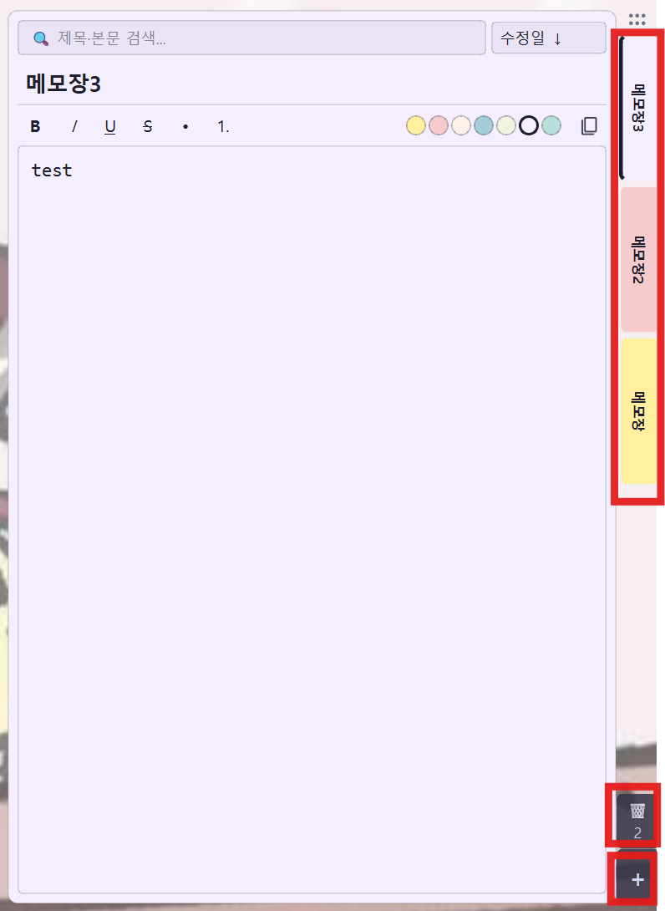
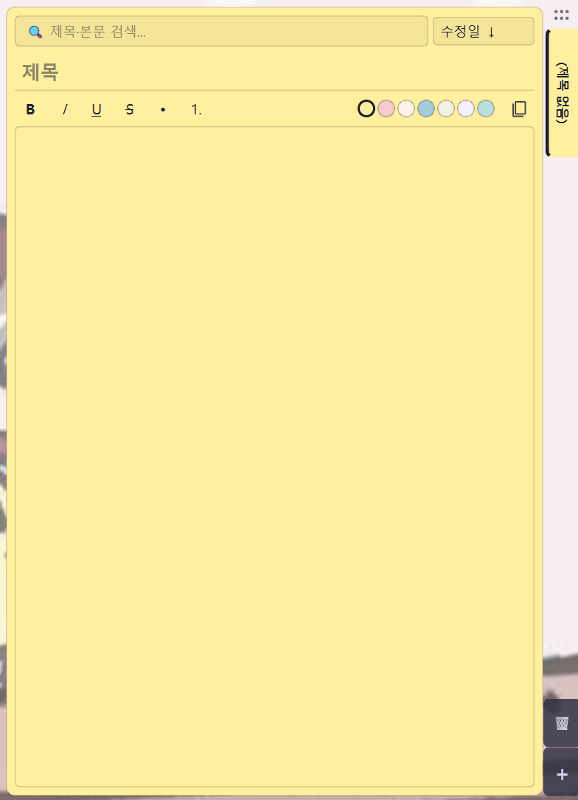
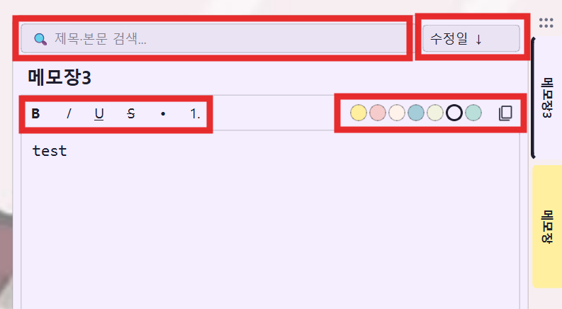
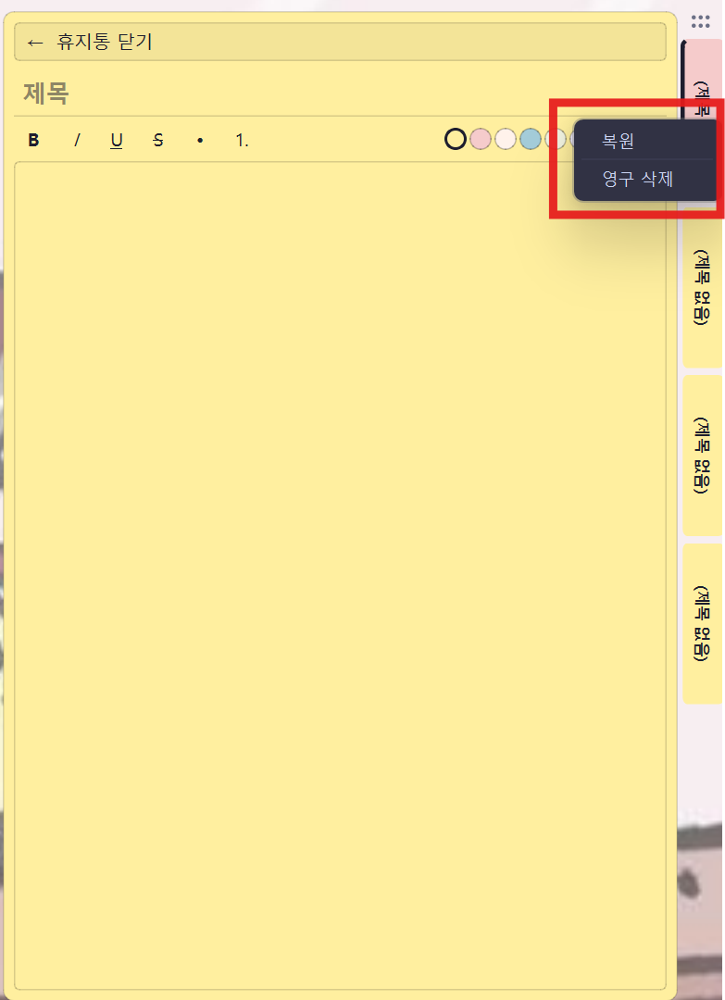

# Slide Memo

Windows 데스크탑용 슬라이드 메모장. 평소엔 화면 우측 끝에 각 메모를 가리키는 색깔 탭들만 보이다가, 탭을 클릭하면 그 메모가 부드럽게 슬라이드되어 펼쳐집니다.

- **Always-on-top** + 작업 표시줄에 안 뜸 → 다른 앱 작업 중 빠르게 토글
- **SQLite 자동 저장** (디바운싱 600ms)
- **메모별 색깔 탭** → 본문 배경도 같은 색 (프리셋 7색 + 사용자 지정 색상)
- **리치텍스트 서식** → 굵게/기울임/밑줄/취소선 + 불릿·번호 목록
- **이미지 붙여넣기** → 캡처 후 `Ctrl+V`로 메모에 바로 표시
- **시스템 트레이**에서도 토글



## 설치

```bash
uv sync
```

## 실행

```bash
uv run python main.py
```

실행하면 화면 우측 가장자리에 메모별 색깔 탭들이 세로로 나열됩니다. 탭을 클릭하면 그 메모가 펼쳐지고, **같은 탭을 다시 누르면 접힙니다.** 트레이 아이콘 클릭으로도 토글됩니다.



## 인터페이스

펼친 메모장 상단에는 검색창·정렬 드롭다운, 그 아래 서식바와 색상 팔레트·복사 버튼이 있습니다.



## 크기 조절

펼친 메모장의 **좌측 / 위 / 아래 가장자리(6px)** 에 마우스를 가져가면 커서가 ↔ 또는 ↕ 모양으로 바뀝니다. 드래그하면 폭/높이/위치를 조절할 수 있고, 변경한 크기는 자동으로 저장되어 다음 실행 때 복원됩니다.

- 좌측 가장자리: 폭 조절 (최소 280px)
- 위 가장자리: 높이 + 위치 조절 (위로 늘림, 최소 200px)
- 아래 가장자리: 높이만 조절 (아래로 늘림)

## 단축키

| 단축키 | 동작 |
|---|---|
| `Esc` | 접기 |
| `Ctrl+N` | 새 메모 |
| `Ctrl+F` | 검색창 포커스 |
| `Ctrl+S` | 수동 저장 |
| `Ctrl+B` / `Ctrl+I` / `Ctrl+U` | 굵게 / 기울임 / 밑줄 |
| `Ctrl+Shift+C` | 메모 본문 전체 복사 |
| `Ctrl+V` | 클립보드 이미지 첨부 (에디터 포커스 시) |

## 메모 관리

- **고정**: 탭 우클릭 → "📌 고정" — 어떤 정렬에서도 항상 맨 위
- **휴지통**: 탭 우클릭 → "🗑 휴지통으로 이동" (soft delete). 탭 컬럼 하단 🗑 버튼으로 휴지통 열어 복원/영구삭제. 휴지통을 모두 비우면 자동으로 일반 모드로 돌아오며, 30일 지난 항목은 시작 시 자동 정리
- **정렬**: 검색창 옆 드롭다운 (수정일 ↓↑ / 제목 A-Z / 생성일 ↓)
- **복사**: 제목 옆 📋 버튼 또는 `Ctrl+Shift+C`

휴지통 모드에서는 탭을 우클릭해 **복원** 하거나 **영구 삭제** 할 수 있습니다.



## 색상 팔레트

서식바 오른쪽의 색상 점을 클릭해 메모 색을 바꿉니다. 기본 프리셋 7색:

| 이름 | hex |
|---|---|
| ivory (기본) | `#FFEF9F` |
| blush | `#F5CBCB` |
| peach | `#FFF2EB` |
| cream | `#A4CCD9` |
| olive | `#F1F3E0` |
| lavender | `#F4EEFF` |
| mint | `#BADFDB` |

### 사용자 지정 색상

색상 점 옆 점선 **`+` 버튼**을 누르면 색상 선택 다이얼로그가 열립니다. 팔레트에서 고르거나 `HTML:` 칸에 `#RRGGBB` 코드를 직접 입력할 수 있습니다. 어두운 색을 고르면 본문·탭의 글자색이 자동으로 밝게 전환되어 가독성을 유지합니다.

## 데이터 위치

| 항목 | 경로 |
|---|---|
| DB | `~/.memo_slide/memos.db` |
| 첨부 이미지 | `~/.memo_slide/images/img_YYYYMMDD_HHMMSS_uuuuuu.png` |

(`~` = `C:\Users\<사용자명>`)

## 종료

탭을 다시 누르면 접힐 뿐 종료되지 않습니다. 완전히 종료하려면 **시스템 트레이 아이콘 → 우클릭 → 종료** 를 사용하세요.

## 폰트

기본은 **D2Coding 11pt**, 시스템에 없으면 자동으로 **Consolas 11pt** 로 fallback 합니다.
